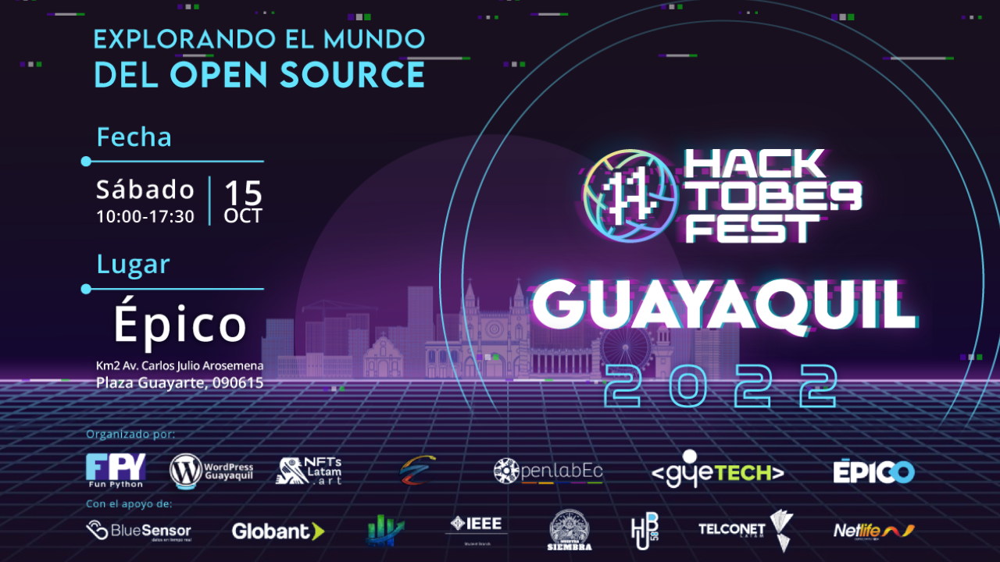

# Hacktoberfest-GYE-2022

<!-- ## ~$ git init -->

## ~$ git clone Hacktoberfest

### ¿Qué es Hacktoberfest?

Hacktoberfest es un festival anual para incentivar la filosofía Open Source durante todo el mes de octubre. El objetivo es fomentar a las personas que usan proyectos open source a participar y contribuir activamente en los repositorios de estos proyectos ya sea en GitLab o GitHub.

## ~$ git add Hacktoberfest/Guayaquil

### ¿Por qué Hacktoberfest Guayaquil?

Hacer un evento local en Guayaquil ayuda a conocer de primera mano a los mantenedores, comunidades y empresas tecnológicas que lideran y apoyan iniciativas para el ecosistema de desarrollo, emprendimiento y divulgación de conocimiento libre.

Puedes conectar con mantenedores para resolver dudas, aprender cosas nuevas y poner en practica tus habilidades. También conocerás oradores con una larga experiencia la industria tecnológica.

El evento contará con mentores que guiarán a participantes a lograr con éxito contribuciones significativa en el ecosistema de código libre.

## ~$ git commit -m " Explorando el mundo del open source"

Para participar en el evento global debes [regístrate con tu cuenta de GitLab/GitHub](https://Hacktoberfest.com/)

El evento será presencial y tendrá lugar en las instalaciones de EPICO en Plaza Guayarte de Guayaquil **desde las 10:00 a 17:30 el dia sábado 15 de octubre si eres puntual tendrás un increíble kit de bienvenida**.

[Confirma tu asistencia meetup](https://www.meetup.com/es-ES/guayaquil-tech/events/288977960/) para **separar tu entrada al evento y ser acreedor a los diferentes sorteos de premios**.

### ¿Qué necesitas para participar?

Si quieres participar en el taller para hacer tus pull/merge request necesitas llevar tu laptop para que puedas desarrollar tus contribuciones. Y no es necesario tener conocimientos en programación.

### Contacto

Para estar enterado de nuevas actualizaciones respecto al evento puedes seguirnos en Instagram:
[@hacktoberfestgye](https://www.instagram.com/hacktoberfestgye/)
[@funpython](https://www.instagram.com/hacktoberfestgye/)

Para contactarte con el organizador puedes escribir al [WhatsApp](https://wa.me/message/AAI3OELJXGBII1) o al correo de la comunidad: funpython.ec@gmail.com

## ~$ git push -u origin evento-2022

### Agenda

<table style="border-collapse:collapse;border-spacing:0" class="tg"><thead><tr><th style="border-color:inherit;border-style:solid;border-width:1px;font-family:Arial, sans-serif;font-size:14px;font-weight:normal;overflow:hidden;padding:10px 5px;text-align:center;vertical-align:middle;word-break:normal">HORA</th><th style="border-color:inherit;border-style:solid;border-width:1px;font-family:Arial, sans-serif;font-size:14px;font-weight:normal;overflow:hidden;padding:10px 5px;text-align:center;vertical-align:middle;word-break:normal">CHARLAS</th><th style="border-color:inherit;border-style:solid;border-width:1px;font-family:Arial, sans-serif;font-size:14px;font-weight:normal;overflow:hidden;padding:10px 5px;text-align:center;vertical-align:middle;word-break:normal">PONENTE/ORGANIZACION</th></tr></thead><tbody><tr><td style="border-color:inherit;border-style:solid;border-width:1px;font-family:Arial, sans-serif;font-size:14px;overflow:hidden;padding:10px 5px;text-align:center;vertical-align:middle;word-break:normal">10:00</td><td style="border-color:inherit;border-style:solid;border-width:1px;font-family:Arial, sans-serif;font-size:14px;overflow:hidden;padding:10px 5px;text-align:center;vertical-align:middle;word-break:normal" colspan="2">REGISTRO</td></tr><tr><td style="border-color:inherit;border-style:solid;border-width:1px;font-family:Arial, sans-serif;font-size:14px;overflow:hidden;padding:10px 5px;text-align:center;vertical-align:middle;word-break:normal">10:30</td><td style="border-color:inherit;border-style:solid;border-width:1px;font-family:Arial, sans-serif;font-size:14px;overflow:hidden;padding:10px 5px;text-align:center;vertical-align:middle;word-break:normal"> INAGURACION</td><td style="border-color:inherit;border-style:solid;border-width:1px;font-family:Arial, sans-serif;font-size:14px;overflow:hidden;padding:10px 5px;text-align:center;vertical-align:middle;word-break:normal">FUNPYTHON, WPGYE, OPEN LAB, GYE-TECH</td></tr><tr><td style="border-color:inherit;border-style:solid;border-width:1px;font-family:Arial, sans-serif;font-size:14px;overflow:hidden;padding:10px 5px;text-align:center;vertical-align:middle;word-break:normal">11:00</td><td style="border-color:inherit;border-style:solid;border-width:1px;font-family:Arial, sans-serif;font-size:14px;overflow:hidden;padding:10px 5px;text-align:center;vertical-align:middle;word-break:normal" colspan="2">ICE BREAKER Y PRESENTACIÓN DE LOS RETOS DE ARTE, DISEÑO, CODING Y COMUNIDADES</td></tr><tr><td style="border-color:inherit;border-style:solid;border-width:1px;font-family:Arial, sans-serif;font-size:14px;overflow:hidden;padding:10px 5px;text-align:center;vertical-align:middle;word-break:normal">11:30</td><td style="border-color:inherit;border-style:solid;border-width:1px;font-family:Arial, sans-serif;font-size:14px;overflow:hidden;padding:10px 5px;text-align:center;vertical-align:middle;word-break:normal">FLOSS &amp; Hacktoberfest</td><td style="border-color:inherit;border-style:solid;border-width:1px;font-family:Arial, sans-serif;font-size:14px;overflow:hidden;padding:10px 5px;text-align:center;vertical-align:middle;word-break:normal">JP</td></tr><tr><td style="border-color:inherit;border-style:solid;border-width:1px;font-family:Arial, sans-serif;font-size:14px;overflow:hidden;padding:10px 5px;text-align:center;vertical-align:middle;word-break:normal">12:00</td><td style="border-color:inherit;border-style:solid;border-width:1px;font-family:Arial, sans-serif;font-size:14px;overflow:hidden;padding:10px 5px;text-align:center;vertical-align:middle;word-break:normal">GIT: GitHub/GitLab</td><td style="border-color:inherit;border-style:solid;border-width:1px;font-family:Arial, sans-serif;font-size:14px;overflow:hidden;padding:10px 5px;text-align:center;vertical-align:middle;word-break:normal">Gustavo Cevallos</td></tr><tr><td style="border-color:inherit;border-style:solid;border-width:1px;font-family:Arial, sans-serif;font-size:14px;overflow:hidden;padding:10px 5px;text-align:center;vertical-align:middle;word-break:normal">12:30</td><td style="border-color:inherit;border-style:solid;border-width:1px;font-family:Arial, sans-serif;font-size:14px;overflow:hidden;padding:10px 5px;text-align:center;vertical-align:middle;word-break:normal">Data Science en Ciberseguridad</td><td style="border-color:inherit;border-style:solid;border-width:1px;font-family:Arial, sans-serif;font-size:14px;overflow:hidden;padding:10px 5px;text-align:center;vertical-align:middle;word-break:normal">Yoshihito Adachi</td></tr><tr><td style="border-color:inherit;border-style:solid;border-width:1px;font-family:Arial, sans-serif;font-size:14px;overflow:hidden;padding:10px 5px;text-align:center;vertical-align:middle;word-break:normal">13:00</td><td style="border-color:inherit;border-style:solid;border-width:1px;font-family:Arial, sans-serif;font-size:14px;overflow:hidden;padding:10px 5px;text-align:center;vertical-align:middle;word-break:normal" colspan="2" rowspan="2">COFFEE BREAK &amp; NETWORKING</td></tr><tr><td style="border-color:inherit;border-style:solid;border-width:1px;font-family:Arial, sans-serif;font-size:14px;overflow:hidden;padding:10px 5px;text-align:center;vertical-align:middle;word-break:normal">13:30</td></tr><tr><td style="border-color:inherit;border-style:solid;border-width:1px;font-family:Arial, sans-serif;font-size:14px;overflow:hidden;padding:10px 5px;text-align:center;vertical-align:middle;word-break:normal">14:00</td><td style="border-color:inherit;border-style:solid;border-width:1px;font-family:Arial, sans-serif;font-size:14px;overflow:hidden;padding:10px 5px;text-align:center;vertical-align:middle;word-break:normal">Uso de repositorios y control de versiones en diseño electronico </td><td style="border-color:inherit;border-style:solid;border-width:1px;font-family:Arial, sans-serif;font-size:14px;overflow:hidden;padding:10px 5px;text-align:center;vertical-align:middle;word-break:normal">Jose Laica</td></tr><tr><td style="border-color:inherit;border-style:solid;border-width:1px;font-family:Arial, sans-serif;font-size:14px;overflow:hidden;padding:10px 5px;text-align:center;vertical-align:middle;word-break:normal">14:30</td><td style="border-color:inherit;border-style:solid;border-width:1px;font-family:Arial, sans-serif;font-size:14px;overflow:hidden;padding:10px 5px;text-align:center;vertical-align:middle;word-break:normal">Emprendiendo en tecnología sin capital semilla usando open source</td><td style="border-color:inherit;border-style:solid;border-width:1px;font-family:Arial, sans-serif;font-size:14px;overflow:hidden;padding:10px 5px;text-align:center;vertical-align:middle;word-break:normal">Branny Chito</td></tr><tr><td style="border-color:inherit;border-style:solid;border-width:1px;font-family:Arial, sans-serif;font-size:14px;overflow:hidden;padding:10px 5px;text-align:center;vertical-align:middle;word-break:normal">15:00</td><td style="border-color:inherit;border-style:solid;border-width:1px;font-family:Arial, sans-serif;font-size:14px;overflow:hidden;padding:10px 5px;text-align:center;vertical-align:middle;word-break:normal">Programación funcional en python</td><td style="border-color:inherit;border-style:solid;border-width:1px;font-family:Arial, sans-serif;font-size:14px;overflow:hidden;padding:10px 5px;text-align:center;vertical-align:middle;word-break:normal">Carlos Villavicencio</td></tr><tr><td style="border-color:inherit;border-style:solid;border-width:1px;font-family:Arial, sans-serif;font-size:14px;overflow:hidden;padding:10px 5px;text-align:center;vertical-align:middle;word-break:normal">15:30</td><td style="border-color:inherit;border-style:solid;border-width:1px;font-family:Arial, sans-serif;font-size:14px;overflow:hidden;padding:10px 5px;text-align:center;vertical-align:middle;word-break:normal">Enseñar para aprender</td><td style="border-color:inherit;border-style:solid;border-width:1px;font-family:Arial, sans-serif;font-size:14px;overflow:hidden;padding:10px 5px;text-align:center;vertical-align:middle;word-break:normal">Kevin Urgiles</td></tr><tr><td style="border-color:black;border-style:solid;border-width:1px;font-family:Arial, sans-serif;font-size:14px;overflow:hidden;padding:10px 5px;text-align:center;vertical-align:middle;word-break:normal">15:45</td><td style="border-color:black;border-style:solid;border-width:1px;font-family:Arial, sans-serif;font-size:14px;overflow:hidden;padding:10px 5px;text-align:center;vertical-align:middle;word-break:normal">Introducción a la web 3</td><td style="border-color:black;border-style:solid;border-width:1px;font-family:Arial, sans-serif;font-size:14px;overflow:hidden;padding:10px 5px;text-align:center;vertical-align:middle;word-break:normal">Bolivar Nuñez &amp; Estefano Campoverde</td></tr><tr><td style="border-color:inherit;border-style:solid;border-width:1px;font-family:Arial, sans-serif;font-size:14px;overflow:hidden;padding:10px 5px;text-align:center;vertical-align:middle;word-break:normal">16:15</td><td style="border-color:inherit;border-style:solid;border-width:1px;font-family:Arial, sans-serif;font-size:14px;overflow:hidden;padding:10px 5px;text-align:center;vertical-align:middle;word-break:normal">REGISTRO Y TRANSFERENCIA DE NFT'S</td><td style="border-color:inherit;border-style:solid;border-width:1px;font-family:Arial, sans-serif;font-size:14px;overflow:hidden;padding:10px 5px;text-align:center;vertical-align:middle;word-break:normal">FUNPYTHON - NTF LATAM ARTS</td></tr><tr><td style="border-color:inherit;border-style:solid;border-width:1px;font-family:Arial, sans-serif;font-size:14px;overflow:hidden;padding:10px 5px;text-align:center;vertical-align:middle;word-break:normal">16:45</td><td style="border-color:inherit;border-style:solid;border-width:1px;font-family:Arial, sans-serif;font-size:14px;overflow:hidden;padding:10px 5px;text-align:center;vertical-align:middle;word-break:normal" colspan="2">PREMIACIÓN DE RETOS</td></tr><tr><td style="border-color:inherit;border-style:solid;border-width:1px;font-family:Arial, sans-serif;font-size:14px;overflow:hidden;padding:10px 5px;text-align:center;vertical-align:middle;word-break:normal">17:00 - 17:30</td><td style="border-color:inherit;border-style:solid;border-width:1px;font-family:Arial, sans-serif;font-size:14px;overflow:hidden;padding:10px 5px;text-align:center;vertical-align:middle;word-break:normal" colspan="2">CIERRE</td></tr></tbody></table>

### Participa y gana

Digital Ocean regalará: “Una camiseta Hacktoberfest de edición limitada o sembrar un árbol conmemorativo por enviar cuatro contribuciones válidas en repositorios públicos entre el 1 y el 31 de octubre”.

- En FunPython, creemos que es importante diversificar las oportunidades y actividades para involucrar a más personas de otras áreas a habitar el mundo de la tecnología, por ello se realizaran concursos de programación de diferentes áreas, retos de arte y diseño, habrán mentores que guiaran a los participantes.

Contribuir al código abierto no es solo para gente técnica que quiere escribir código. Hay muchas oportunidades para utilizar sus habilidades profesionales en apoyo de proyectos de código abierto. Este año, nos esforzamos por fomentar las contribuciones que requieren alguna experiencia técnica o ninguna. No importa tu experiencia, ¡puedes participar en Hacktoberfest!

Hacktoberfest da la bienvenida a personas de cualquier nivel de experiencia para participar, y las contribuciones de código bajo y sin código son opciones fantásticas para las personas que no tienen muchos conocimientos técnicos. Estos son algunos ejemplos de formas en que puede contribuir a proyectos de código abierto:

| CONTRIBUCIÓN  | CÓDIGO BAJO               | SIN CÓDIGO                                                  |
| ------------- | ------------------------- | ----------------------------------------------------------- |
| Escritura     | Documentación técnica     | Traducción de documentación                                 |
| Diseño        | Pruebas                   | Experiencia de usuario, diseño gráfico, producción de video |
| Evangelizador | Charlas, mentarías, blogs | Exposición en redes sociales                                |
| Retos         | Coding game               | Arte/diseño con nft                                         |

# Premios

- 1 premio sorpresa
- 1 año de internet gratis
- 50 boletos edición limitada con NFT
- Camisas, tazas y stickers edición limitadas del evento

<!-- ### Oradores -->

<!-- ### Patrocinadores -->

<!-- ### Equipo organizador -->

### Código de Conducta

Los eventos de Hacktoberfest son amigables, abiertos, e inclusivos. Por favor leer [nuestro código de conducta](CODE_OF_CONDUCT.md) antes de asistir al evento. Happy hacking!
